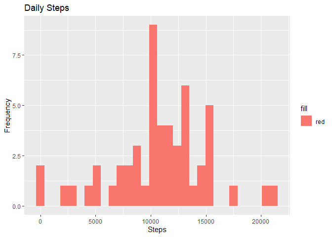
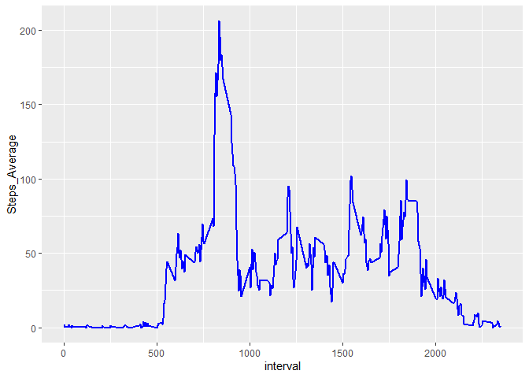
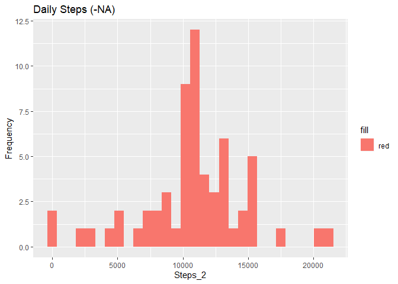

Download and extract zip data. Read into object named "activity".


```r
download.file("https://d396qusza40orc.cloudfront.net/repdata%2Fdata%2Factivity.zip", destfile = "activity.zip")

unzip(zipfile = "activity.zip")

activity <- read.csv(file = "activity.csv", header = TRUE)
```

Calculate sum of steps per day. 


```r
Steps <- activity %>%
    group_by(date) %>%
  summarise(Steps = sum(steps))
```

Summary table of top ten rows.


```r
head(Steps)
```

```
## # A tibble: 6 x 2
##   date       Steps
##   <fct>      <int>
## 1 2012-10-01    NA
## 2 2012-10-02   126
## 3 2012-10-03 11352
## 4 2012-10-04 12116
## 5 2012-10-05 13294
## 6 2012-10-06 15420
```

Histogram


```r
qplot(x = Steps, data = Steps,geom = "histogram", fill = "red", ylab = "Frequency", main = "Daily Steps")
```

```
## `stat_bin()` using `bins = 30`. Pick better value with `binwidth`.
```

```
## Warning: Removed 8 rows containing non-finite values (stat_bin).
```

<!-- -->

Mean and median of steps per day.


```r
MeanMedian <- c(mean(Steps$Steps, na.rm = TRUE), median(Steps$Steps, na.rm = TRUE))
MeanMedian <- data.frame(MeanMedian)
MeanMedian <- t(MeanMedian)
colnames(MeanMedian) <- c("Mean", "Median")
print(MeanMedian)
```

```
##                Mean Median
## MeanMedian 10766.19  10765
```

Average number of steps per day.

```r
AverageSteps <- activity %>%
  group_by(interval) %>%
  summarize(Steps_Average = mean(steps, na.rm=TRUE))
```
Summary table of top ten rows.

```r
head(AverageSteps)
```

```
## # A tibble: 6 x 2
##   interval Steps_Average
##      <int>         <dbl>
## 1        0        1.72  
## 2        5        0.340 
## 3       10        0.132 
## 4       15        0.151 
## 5       20        0.0755
## 6       25        2.09
```
Plot time series graph

```r
ggplot(data = AverageSteps, aes(x = interval, y = Steps_Average))+
  geom_line(color = "blue", size = 1)
```

<!-- -->
Maximum 5 minute interval

```r
subset(AverageSteps,AverageSteps$Steps_Average==max(AverageSteps$Steps_Average))
```

```
## # A tibble: 1 x 2
##   interval Steps_Average
##      <int>         <dbl>
## 1      835          206.
```
Calculate NA values in activity.

```r
colSums(is.na(activity))
```

```
##    steps     date interval 
##     2304        0        0
```
Replace NA values with mean for that 5 minute interval.

```r
idx <- match(activity$interval, AverageSteps$interval)
activity[1:17568,4] <- AverageSteps$Steps_Average[idx]
activity2 <- activity %>%
  mutate(steps = ifelse(is.na(steps), V4, steps))
activity2$V4<-NULL
head(activity2)
```

```
##       steps       date interval
## 1 1.7169811 2012-10-01        0
## 2 0.3396226 2012-10-01        5
## 3 0.1320755 2012-10-01       10
## 4 0.1509434 2012-10-01       15
## 5 0.0754717 2012-10-01       20
## 6 2.0943396 2012-10-01       25
```
Plot histogram.

```r
Steps2 <- activity2 %>%
  group_by(date) %>%
  summarise(Steps = sum(steps))
names(Steps2)[2] <- "Steps_2"

qplot(x = Steps_2, data = Steps2,geom = "histogram", fill = "red", ylab = "Frequency", main = "Daily Steps (-NA)")
```

```
## `stat_bin()` using `bins = 30`. Pick better value with `binwidth`.
```

<!-- -->
Mean and median of steps per day.


```r
MeanMedian2 <- c(mean(Steps2$Steps_2, na.rm = TRUE), median(Steps2$Steps_2, na.rm = TRUE))
MeanMedian2 <- data.frame(MeanMedian2)
MeanMedian2 <- t(MeanMedian2)
colnames(MeanMedian) <- c("Mean", "Median")
print(MeanMedian2)
```

```
##                 [,1]     [,2]
## MeanMedian2 10766.19 10766.19
```
Difference between weekday and weekend.  Add columns to classify weekday from weekend.

```r
activity3 <- data.table::fread(input = "activity.csv")
activity3[, date := as.POSIXct(date, format = "%Y-%m-%d")]
activity3[, `Day of Week`:= weekdays(x = date)]
activity3[grepl(pattern = "Monday|Tuesday|Wednesday|Thursday|Friday", x = `Day of Week`), "weekday or weekend"] <- "weekday"
activity3[grepl(pattern = "Saturday|Sunday", x = `Day of Week`), "weekday or weekend"] <- "weekend"
activity3[, `weekday or weekend` := as.factor(`weekday or weekend`)]
head(activity3, 10)
```

```
##     steps       date interval Day of Week weekday or weekend
##  1:    NA 2012-10-01        0      Monday            weekday
##  2:    NA 2012-10-01        5      Monday            weekday
##  3:    NA 2012-10-01       10      Monday            weekday
##  4:    NA 2012-10-01       15      Monday            weekday
##  5:    NA 2012-10-01       20      Monday            weekday
##  6:    NA 2012-10-01       25      Monday            weekday
##  7:    NA 2012-10-01       30      Monday            weekday
##  8:    NA 2012-10-01       35      Monday            weekday
##  9:    NA 2012-10-01       40      Monday            weekday
## 10:    NA 2012-10-01       45      Monday            weekday
```
Plot 2 time series plots to demonstrate difference.

```r
activity3[is.na(steps), "steps"] <- activity3[, c(lapply(.SD, median, na.rm = TRUE)), .SDcols = c("steps")]
Interval2 <- activity3[, c(lapply(.SD, mean, na.rm = TRUE)), .SDcols = c("steps"), by = .(interval, `weekday or weekend`)] 

ggplot(Interval2 , aes(x = interval , y = steps, color=`weekday or weekend`)) + geom_line() + labs(title = "Avg. Daily Steps by Weektype", x = "Interval", y = "No. of Steps") + facet_wrap(~`weekday or weekend` , ncol = 1, nrow=2)
```

<!-- -->


